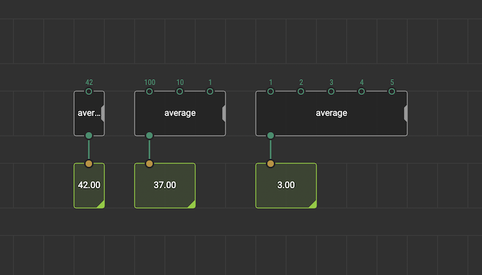
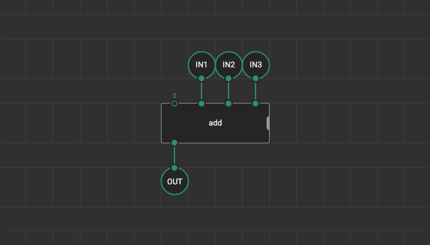
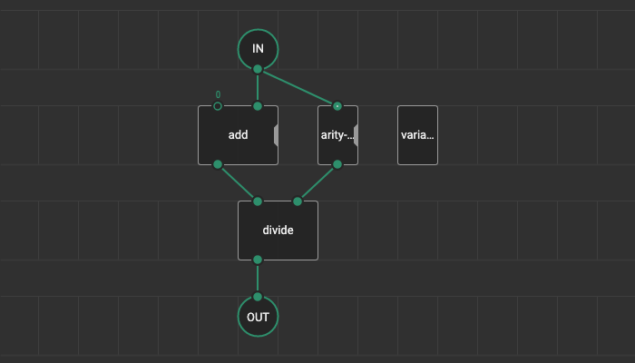

# Creating variadic-pass Nodes

`variadic-pass` nodes allow to create wrappers around ["real" variadic nodes](../variadics). Such wrappers have much less strict requirements for input and output pins and allow to hide implementation details from the end user.

Let's create the `average` node that looks like this:

It will add input values together and divide the sum by the number of inputs. Note that there are no accumulator and shared inputs, all the input pins are variadic.

## Markers

Just like with regular variadics, you will need to place a special marker node on your patch. Find the marker node under the `xod/patch-nodes` library. You need `variadic-pass-1`, `variadic-pass-2`, or `variadic-pass-3`. The number defines the arity step, that is the group size by which the rightmost input pins replicate.

Let's start creating our `average` patch already. First, we'll deal with "add input values together" part. Add a numeric input and output, `add` and `variadic-pass-1` nodes:

## Expansion of variadic-pass nodes

Unlike regular regular variadic nodes, during transpilation variadic-pass nodes are not expanded into a cascade. Instead, the input terminals propagate the arity level set down to the variadic nodes to which they link. The arity level gets added to the design-time arity level. Then the links incoming to the outer variadic-pass node are directly transferred/replicated to the inner variadic nodes. 

Here is what would happen under the hood with the node we just made when it's expanded with arity level 3:

And after that’s done, the expansion of regular variadic nodes takes place.

## Getting arity level of a variadic-pass node

Now let's build the rest of out `average` node. To do that, we need a way to know the arity level of our node. For this exact purpose, there is a `arity-level` node in `xod/core`. When linked to a variadic-pass input, it will output the arity level of the parent node. Note that there are no magic tricks going on — it's built with methods available to any other xoder, and I'd recommend playing with it and checking out how it is implemented.

Here is how it's used to build a finished version of the `average` node:

Note that there are two variadic nodes connected to a single variadic-pass input now. It's perfectly legal and both will be expanded the way we saw earlier.
